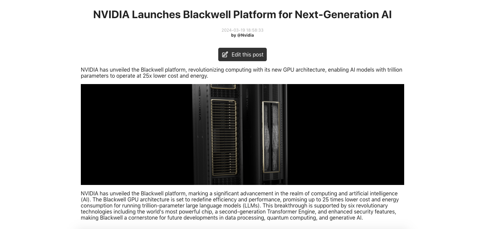
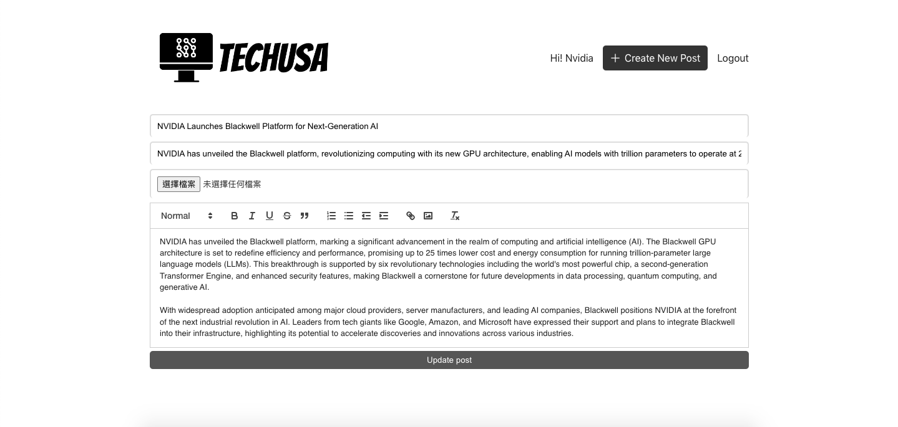
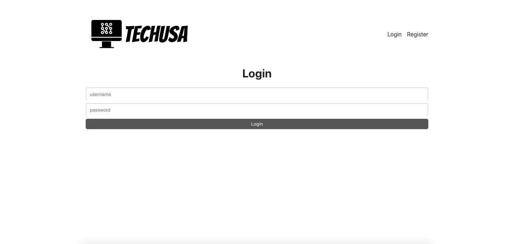
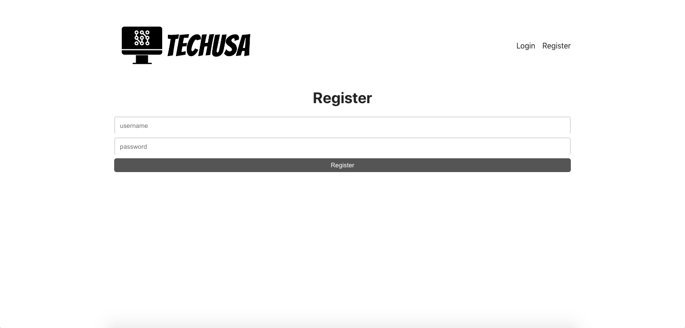

# TechUSA (MERN stack application)
<a href='https://github.com/shivamkapasia0' target="_blank"></a>
<a href='https://github.com/shivamkapasia0' target="_blank"></a>
<a href='https://github.com/shivamkapasia0' target="_blank"></a>
<a href='https://github.com/shivamkapasia0' target="_blank"></a>
This is a frontend/backend application for writing news for tech companies. 

## Table of Contents
- [TechUSA (MERN stack application)](#techusa-mern-stack-application)
  - [Table of Contents](#table-of-contents)
  - [Motivation](#motivation)
  - [Features](#features)
        - [Core (MERN stack)](#core-mern-stack)
        - [Authentication \& Security](#authentication--security)
  - [Installation and Setup](#installation-and-setup)
  - [Demo](#demo)
      - [Home Page](#home-page)
      - [Post Page](#post-page)
      - [Edit Page](#edit-page)
      - [Login Page](#login-page)
  - [Contact Information](#contact-information)

## Motivation
For the current websites, news are generally written by a single compay

## Features
-  Write/ Edit post for specific companies when login with account
- 🛏️ Register/ Login function for companies to write post for its own compnay

##### Core (MERN stack)
- [MongoDB](https://www.mongodb.com/) to store user, item, and reservation data
- [Express](https://expressjs.com/) as the web server framework. Express is chosen for its performance, and features for web applications
- [React](https://react.dev/) for 
- [Nodejs](https://nodejs.org/) for server-rendered React applications
##### Authentication & Security
- [bcrypt](https://www.npmjs.com/package/bcrypt) for hashing passowrd before storing, ensure secure storage of user credentials
- [jsonwebtoken](https://www.npmjs.com/package/jsonwebtoken) for handling JSON Web Tokens, providing a secure way to transmit data between parties as a JSON object
- [cors](https://yarnpkg.com/package?name=cors) to enable Cross-Origin Resource Sharing, allowing the front end and back end to communicate securely

## Installation and Setup
1. Clone the repository
   ```bash
   git clone https://github.com/yi-cheng-liu/techusa.git
   ```
2. Navigate to the project directory
   ```bash
   cd techusa
   ```
3. Install dependencies of frontend and backend
   ```bash
   yarn # backend
   cd client/
   yarn # frontend
   ```
4. Run the server, runs at http://localhost:4000
   ```bash
   cd api/
   node index.js
   ```
5. Run the client, runs at http://localhost:3000
   ```bash
   cd client
   yarn start
   ```
   Open http://localhost:3000 with your browser to see the webstite.


## Demo
#### Home Page


#### Post Page


#### Edit Page


#### Login Page
| Login Page               | Register reservation      
:-------------------------:|:------------------------:
| 


## Contact Information
For more information or contributions, you can reach us at:
Yi-Cheng Liu, Email: whsjerryliu@gmail.com or liuyiche@umich.edu